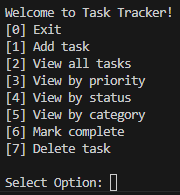
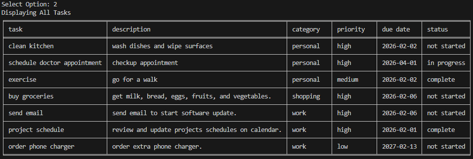
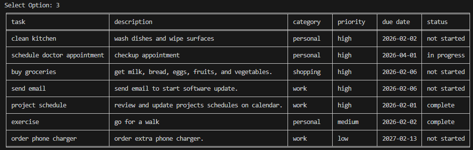
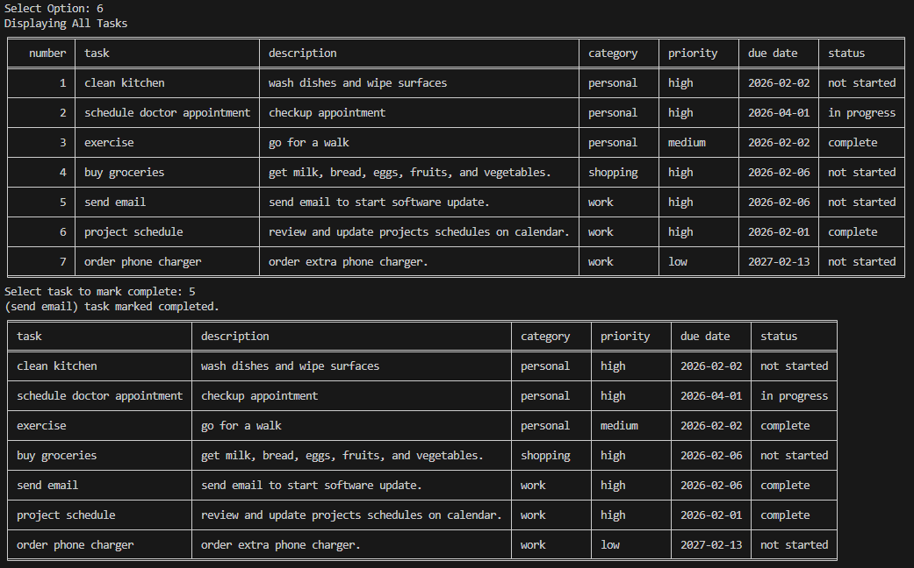

markdown

# Task Manager

A simple command-line todo task list application that allows user to create, organize, and track tasks with JSON storage.

## Features

- Add and delete task. User can enter task with title, description, category, priority, due date, and status.
- Select any task and mark task complete.
- Automatic save/load functionality. Creates JSON file and or empty global lists if any files are missing or problematic.
- Input validation. Rejects invalid user inputs and provides feedback.
- User can choose to filter and view by priority, status, or view all tasks.

## How to Run
```
bash
git clone https://github.com/andreigurd/todo-list
cd todo-list
pip install tabulate
python todo_list.py
```
**Prerequisites:**
- Python 3.x
- pip packages: `tabulate`.

## 📸 Screenshots





## 🧠 What I Learned
- Making a Plan.md file at begining was very valuable. Helped plan out menu and functions. Avoided re numbering and re work.
- Making a global valid input variable is valuable when restricting user input.
- Displaying tasks by priority level from high priority to low was difficult. Tasks were assigned numbers 1 to 3 without displaying to user to allow chronological sorting.
- I would display tasks differently to only show tasks that have been started in the mark complete option/feature to avoid marking not started or already complete tasks complete.

## 🔮 Future Improvements
- Auto alerts for when due dates are a day away and when they are overdue.
- Add recurring tasks.
- Add difficulty level for tasks.

## 🤝 Contributing
This is a learning project, but feedback is welcome!